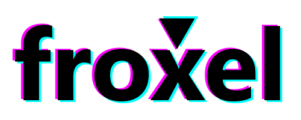

<p align="center">
	
	<br/>
	<span>Froxel Game Engine</span>
</p>

<br/>

## Installation

You can use npm/yarn to install the framework in your project, or download the standalone `froxel.min.js` file from the `dist` folder and include it in your project directly. When using the latter, a global object named `froxel` will be available.

```sh
yarn add froxel
```


<br/>

## Getting Started

The fastest way to get started is to create a froxel project from a template, build it and view it on your browser. To create a project in folder "test", run:

```sh
npx froxel create "test"
```

You need to have parcel and shx (preferrably globally installed). You can install them yourself or just run `yarn requirements` from your froxel project to get those installed automatically.

Build your project using `yarn build` and then just open the index.html file in your browser.
